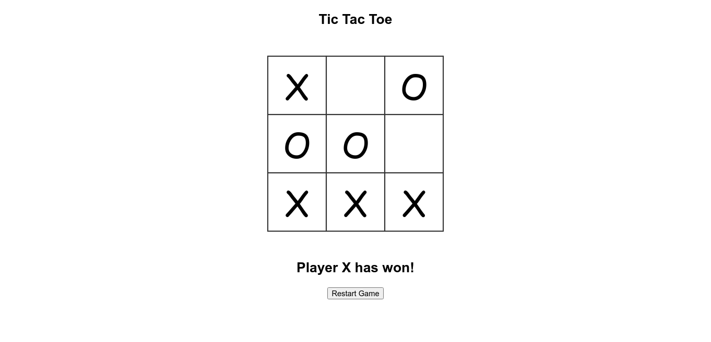

##### 00:40
Starting to migrate Raahee Blog to Markdown.

##### 21:00
It's been a whole day of work and I haven't written anything yet, so I'm gonna divide this into subsection with the work that I did.

#### Raahee
I worked on Raahee till approximately 4:30. The majority of that time was taken by actually looking for the best choice of markdown for our use case. Since none of the Markdown Editors I found had internal link support, I decided to pick `rich-markdown-editor` for the simple reason that people writing the blog may not be having knowledge to write Markdown using syntax, so this allows for them to modify using mouse. Neat! I know. :)

#### MLH LocalHackDay
Today's challenges took a lot of time since I decided to pick up some ambitious projects.

1. The first challenge was playing the chrome dino game. Easy! Yeah!  
Then came the programming challenges.
2. The next challenge I picked was one where we had to build something to save food. In my opinion if you have a good cook, food will never go to waste! 
😂  
But I had to develop something. So I made a project that could take input of the ingredients that you have in your fridge/readily available and it will give you recipes according to that. This took me around 2 hours since designing the front-end without Bootstrap and MaterialUI, after being dependent on React for so long was a tough task.

  

3. Then arrived the challenge of making a Tic Tac Toe game. I had built it using Java when I was in first year so I decided to take on JavaScript since that was what I had been working with all day. Also, I didn't have Java SDK and all of that. So I started building and decided to take help in front end from a website, and when I was done, it was already 14:30. Nevertheless, it looked pretty good, but I guess that's what happens when you take someone else's CSS. 😛

  

4. The third programming task of the day was to build a Random Number Generator, and it goes without saying that we couldn't use internal random functions. So I remembered what I had studied in 6th semester about [Linear Congruential Generator](https://en.wikipedia.org/wiki/Linear_congruential_generator) and decided to write the code for that. Was done with that pretty quickly, cuz you know `C++`

  ```cpp
  #include <bits/stdc++.h>
  using namespace std;

  int Random(int Xo, int m, int a, int c) {
    cout << Xo << " ";
    return ((Xo * a) + c) % m;
  }

  int main() {
    int Xo = 2432;  // Initial value
    int m = 134456; // mod
    int a = 8121;   // Multiply
    int c = 28411;  // add

    for (int i = 0; i < 10; i++) {
        Xo = Random(Xo, m, a, c);
    }

    return 0;
  }
  ```

5. Now what turned out to be the most ambitious project of today. Making an app that fetches emotions from facial expressions and gets a song according to that from the Spotify API. This project took almost 2 hours and some sleep.
I used `face-api.js` for the extraction, which was really hard to use but since I had explored it the previous night, it helped me a lot. I know, I know, time for an image.

  

  Don't mind the hand, there was a lot of light coming from behind, so it was behaving a bit finicky.

Well those were all the daily challenges that I decided to pick up for today and it has been a really tiring day.  
AND I HAVEN'T DONE TODAY'S [LEETCODE CHALLENGE](https://leetcode.com/explore/featured/card/january-leetcoding-challenge-2021/580/week-2-january-8th-january-14th/3601/).

Wow, my brain is completely shut down. Took so much time to write code for this simple problem.

```cpp:title=add-two-numbers.cpp
ListNode *addTwoNumbers(ListNode *l1, ListNode *l2)
{
    ListNode *head = NULL, *prev = NULL;
    int carry = 0;
    while (l1 || l2)
    {
        int v1 = l1 ? l1->val : 0;
        int v2 = l2 ? l2->val : 0;
        int tmp = v1 + v2 + carry;
        carry = tmp / 10;
        int val = tmp % 10;
        ListNode *cur = new ListNode(val);
        if (!head)
            head = cur;
        if (prev)
            prev->next = cur;
        prev = cur;
        l1 = l1 ? l1->next : NULL;
        l2 = l2 ? l2->next : NULL;
    }
    if (carry > 0)
    {
        ListNode *l = new ListNode(1);
        prev->next = l;
    }
    return head;
}
```

I'll attend the event at 22:30 tonight and then sleep. Let's see how many points I have. 🎉 

> Ciao!

### EOD Checklist
- [x] Leetcode January Challenge
- [x] Raahee
- [x] This blog