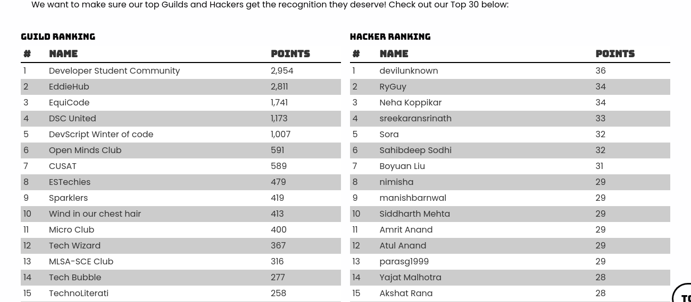
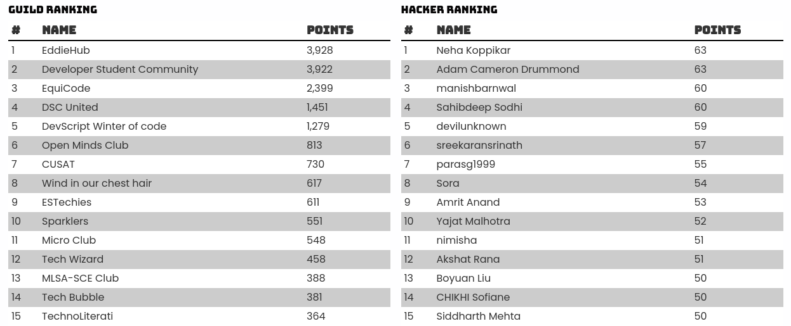

##### 7:00
So I woke up on time today, thanks to sleeping at 1:30 😆

Guess who's #13 on leaderboard. 🕺



Gonna start working on today's challenges for MLH LocalHackDay. Coming up fist is Twilio API. I was thinking about integrating Sendgrid with a project but wasn't sure if Twilio integrated with Sendgrid. I mean don't get me wrong, I have been using Sendgrid for a long time and I think I remember it being associated with Twilio but I have to check.

1. **Email-Prank**: So the first project will be an application to send emails to anyone using any email address. Particularly useful when you have to pull a prank on someone, also when you wanna surprise someone 🙃
The screenshot is not worth uploading here but you can check my submission on [DevPost](https://devpost.com/software/email-prank-dxb1r3).

2. **BattleSnake**: 
I discovered this cool thing called [BattleSnake](https://play.battlesnake.com/). Oh yeah, I'll tell you what it is. It's essentially a game, not like any other game you play on your smartphone or PC, but a very sophisticated one. You remember the snake game? It's more or less like that only, the diffrencec being that there are multiple snakes on board and you can't collide with board, yourslef or them. 
Sounds simple? Well here's the catch, you don't play the game. You have to code a server that makes decisions based on board state about where your BattleSnake should go.

  So I decided to take it for a spin. The documentation is super unclear so I'll probably write a post about that in the future. I decided to implement just board collision avoidance for the basic version but I'll work on it in the future.

3. **Web Scraping**: 
This was a weekly challenge but there was also a daily challenge of visualising data in the form of a diagram (for the lack of a better word). So I decided to combine both of these. Used beautiful-soup to parse the HTML document returned and then matplotlib to generate a pie chart. 2 *points here I come!* 

> I should take a break!

##### 16:00
Here I am, after 2 hours. Time to complete today's [Leetcode Challenge](https://leetcode.com/explore/featured/card/january-leetcoding-challenge-2021/580/week-2-january-8th-january-14th/3602/).
It was easy, sort and then 2 pointer approach to check if the person with greater weight can be adjusted with anyone else.

```cpp:title=baots-to-save-poeple.cpp
int numRescueBoats(vector<int> &people, int limit) {
	sort(people.begin(), people.end());

	int i = 0;
	int j = people.size() - 1;
	int boats = 0;

	while (i <= j) {
    boats++;
		if (i == j) {
			break;
		}

		if (people[i] + people[j] <= limit) {
			i++;
		} 
    j--;
	}
	return boats;
}
```

Time complexity `O(nlogn)` because of sorting, and space complexity is `O(1)` 🎉

##### 23:00
I worked on Raahee community page and I got really frustrated. The code for the Community page is completely unmanageable so I'll move the comments list to another component.

And I'm #7 on LocalHackDay!!!



##### 23:00
Let's work on Raahee. I have a deadline and I need to deliver!

### EOD Checklist
- [x] Leetcode January Challenge
- [x] Raahee
- [x] This blog