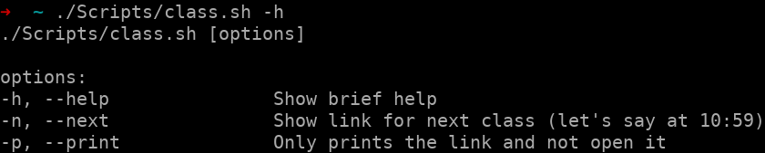

##### 9:40
Classes today! But I'm excited. I missed the first class coz sleep you know. :p

Anyway let's attend the class at 10:00

##### 11:00
Oh no! Stupid me just realised that I attended the wrong class. It's Wednesday and I attended the class according to Monday. And the weird thing, even the teacher thought it was Monday, so he started teaching. 

So now I'm on another task. Creating a script that will allow me to open the link for current class when running it. No more worrying about time tables, classes and days. Just run the script and relax.

##### 13:00
Done! Script that opens the google meet for the current class. It can be found here on [GitHub](https://github.com/parasg1999/Scripts/blob/main/class.sh).

##### 15:00
Okay, so someone contacted me on LinkedIn to ask a doubt and I have scheduled a video call with him. Let's see what happens. I hope I don't embarrass myself.

##### 16:15
Okay solved! Time to flex a bit. The doubt was much more related to `npm` that React itself, so I guess it went fine.

> Time for a break

##### 22:00
I bought [raahee.in](https://raahee.in) yesterday for Raahee and set up the DNS A records but it's been more than 24 hours and the records haven't propagated which is so sad. So I finally decided to move to Azure DNS. 

##### 22:10
Completed setting up the Azure DNS and linking the Azure NS to [nettigritty.com](nettigritty.com). Waiting for the DNS records to propagate since I can't get lets encrypt certificate before the domain actually resolves to the IP address.

##### 22:00
Oh wow! 10 minutes. That was quick, like flash quick! So anyway now that it is able to point to the IP address of the machine, it's time to get the certificates and restart NGINX. Don't worry, I already updated the records yesterday and just had to restart the `nginx.serivce`. Talk about time management.

##### 23:00
Time to put my PC to rest.

> Until tomorrow :)

### EOD Checklist
- [ ] Leetcode January Challenge
- [x] This blog